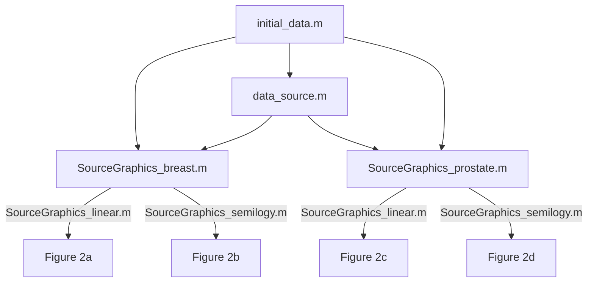
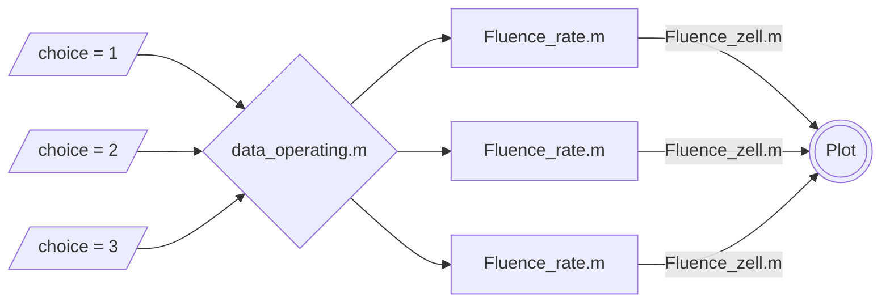

# Description

> [!NOTE] 
> Description is in the process of being written.

## Repository structure

The repository includes files such as README, LICENSE, CODE_OF_CONDUCT, SECURITY, CITATION,
and the following directories, which contain the computer code for research on modeling Focal Laser Ablation (FLA). 
* [Data](#data-directory-contents)
* [Source](#graphical-representations-of-the-source-s-directory-contents)
* [Exact solutions](#exact-solutions-directory-contents)
* [Fluence rate](#graphical-representations-of-the-fluence-rate-directory-contents)

## Data directory contents

### [data_geometry.m](data/data_geometry.m)

This script stores the geometric parameters only [mm]. In this script, the value L0 is set to zero. However, the present code allows other values for L0.

### [initial_data.m](Data/initial_data.m)

This script stores the initial data [mm], including the geometric parameters. References of the optical parameters [cm]:

- Jacques, S. Optical properties of biological tissues: A review. *Phys. Med. Biol.* **58** (2013), R37-R61. <https://doi.org/10.1088/0031-9155/58/11/R37>
- Sandell, J.; Zhu, T. A review of in-vivo optical properties of human tissues and its impact on PDT. *J. Biophotonics* **4** (2011), 773-787. <https://doi.org/10.1002/jbio.201100062>
- Niemz, M. *Laser-tissue interactions: Fundamentals and applications*. Springer-Verlag, 2007.
- Capart, A.; Ikegaya, S.; Okada, E.; Machida, M.; Hoshi, Y. Experimental tests of indicators for the degree of validness of the diffusion approximation. *J. Phys. Commun.* **5** (2021), 025012. <https://doi.org/10.1088/2399-6528/abe4e1>

### [data_source.m](Data/data_source.m)

This script stores parameters for the source of scattered photons $S$.

### [data_operating.m](Data/data_operating.m)

This script stores the wavelengths and powers under study, and correspondent temporal pulse widths:
- choice = 1: 810 nm; 5 W; t_diode = 10 ps.
- choice = 2: 980 nm; 5 W; t_diode = 10 ps.
- choice = 3: 980 nm; 1.3 W; t_diode = 10 ps.
- choice = 4: 1064 nm; 1.3 W; t_NdYAG = 2ms.

### [data_work.m](Data/data_work.m)

This script stores the working parameters, according to Appendices A and B <https://doi.org/10.3390/photonics12040400>.

## Graphical representations of the source S directory contents

The folder [SourceGraphicalRepresentations](SourceGraphicalRepresentations) deals with the source of the scattered photons $S$ $[\textnormal{W/mm}^3]$, defined in (2) [Consiglieri, 2025a], and its graphical representations in Figure 2 [Consiglieri, 2025a].

[Consiglieri, 2025a]: Consiglieri, Luisa. Exact solutions to cancer laser ablation modeling. arXiv:2503.07226 [math.AP] (2025) <https://doi.org/10.48550/arXiv.2503.07226>.

> The wavelengths and powers under study are to simulate two types of lasers:
>
> - Q-switched short-pulsed Nd:YAG laser operating at a wavelength of 1064 nm and power of 1.3 W;
>
> - diode short-pulsed laser operating at wavelengths of
> 
>    - 810 nm and power of 5 W;
>
>    - 980 nm and powers of 1.3 W and 5 W.

### [SourceGraphics_linear.m](SourceGraphicalRepresentations/SourceGraphics_linear.m)

This function produces 2-D plots to the source $S(r_\mathrm{f},z)$ for the wavelengths and powers under study. This function assumes that the input arguments z1, source1, z2, and source2 are all properly defined and have the correct dimensions when calling the function.

### [SourceGraphics_semilogy.m](SourceGraphicalRepresentations/SourceGraphics_semilogy.m)

This function produces 2-D plots, using a logarithmic scale for the y-axis, to the source $S(r_\mathrm{f},z)$ for the wavelengths and powers under study. This function assumes that the input arguments z1, source1, z2, and source2 are all properly defined and have the correct dimensions when calling the function.

### [SourceGraphics_breast.m](SourceGraphicalRepresentations/SourceGraphics_breast.m)

This script produces the graphical representations to the source $S(r_\mathrm{f},z)$ in the tumor-healthy breast tissue, as illustrated in Figures 2a and 2b.

### [SourceGraphics_prostate.m](SourceGraphicalRepresentations/SourceGraphics_prostate.m)

This script produces the graphical representations to the source $S(r_\mathrm{f},z)$ in the tumor-healthy prostate tissue, as illustrated in Figures 2c and 2d.

## Exact solutions directory contents

The folder [ExactSolutions](ExactSolutions) deals with the fluence rate $\phi$, and its exact form as established in Section 4.1 (at $t = t_\mathrm{p}$) [Consiglieri, 2025].

[Consiglieri, 2025] Consiglieri, Luisa. Exact Solutions to Cancer Laser Ablation Modeling. *Photonics* **12** :4 (2025), 400. <https://doi.org/10.3390/photonics12040400>

### [Zsolution.m](ExactSolutions/Zsolution.m)

This function computes the longitudinal elementary solution $Z(z)$. This function assumes that the input argument (mu_t, eta, zz, ell, index_z) is provided correctly when calling the function. As defined in [initial_data.m](Data/initial_data.m):
* mu_t stands for total attenuation coefficient $\mu_\mathrm{t}$ $[\mathrm{mm}^{-1}]$;
* zz stands for the optical coordinate $z$;
* ell stands for the longitudinal distance $z = \ell$, corresponding to the tumor-healthy interface;
* index_z stands for the relevant indices of zz, namely the location of the focus $z=0$ and the tumor-healthy interface $z = \ell$,

while eta is the real parameter $\eta$.

### [Rsolution_A1.m](ExactSolutions/Rsolution_A1.m)

This function computes the radial elementary solutions.
- Inputs:
  - bt - Parameter $(\beta_1, \beta_2)$ related to fluence distribution, as defined in Appendices A.1 and B, respectively;
  - Rf       - Maximum value of the radial solution;
  - r        - Array of r-coordinates;
  - index_r  - Relevant indices in the radial direction, namely the fiber radius $r_\mathrm{f}$ and the inner radius $r_\mathrm{i}$.
- Output: R_1 (Appendix A.1) altogether with R_2 (Appendix B).

### [Rsolution_A2.m](ExactSolutions/Rsolution_A2.m)

This function computes the radial elementary solutions.
- Inputs:
  - beta_out - Parameter $\beta_2$ related to fluence distribution, as defined in Appendix B;
  - Rf       - Maximum value of the radial solution;
  - r        - Array of r-coordinates;
  - index_r  - Relevant indices in the radial direction, namely the fiber radius $r_\mathrm{f}$ and the inner radius $r_\mathrm{i}$;
  - b0       - positive constant determined with the Robin boundary condition (6), which is given at Appendix A2.
- Output: R_3 (Appendix A.2) altogether with R_4 (Appendix B).

## Graphical representations of the fluence rate directory contents

The folder [FluenceGraphicalRepresentations](FluenceGraphicalRepresentations) deals with the graphical representations of the fluence rate $\phi$ $[\textnormal{W/mm}^2]$, as illustrated in Figures 3 and 4 if $t_\mathrm{p} = 10$ ps and $t_\mathrm{p} = 1$ ps, respectively [Consiglieri, 2025].

### [RadialGraphics.m](FluenceGraphicalRepresentations/RadialGraphics.m)

This script is structured as follows:

### [RadialGraphics_breast.m](FluenceGraphicalRepresentations/RadialGraphics_breast.m)

This script plots Figures 3a and 4a, under the function [data_operating.m](Data/data_operating.m) with t_diode = 10 ps and t_diode = 1 ps, respectively,
and it is structured as follows:

### [RadialGraphics_prostate.m](FluenceGraphicalRepresentations/RadialGraphics_prostate.m)

This script plots Figures 3c and 4c, under the function [data_operating.m](Data/data_operating.m) with t_diode = 10 ps and t_diode = 1 ps, respectively,
and it is structured as follows:
